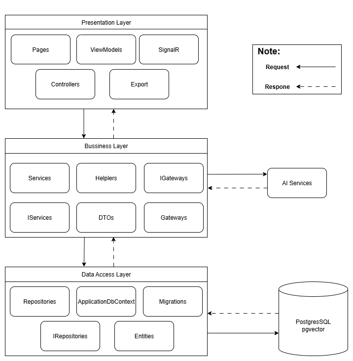

# 🤖 ChatEdu AI - Hệ Thống Trợ Lý Học Tập Thông Minh



## 📖 Giới Thiệu Dự Án

ChatEdu AI là một nền tảng web ứng dụng Trí tuệ nhân tạo (Generative AI), hỗ trợ học tập thông minh. Hệ thống giúp sinh viên dễ dàng tra cứu, ôn tập và hỏi đáp kiến thức một cách chính xác dựa trên nguồn tài liệu chuẩn (.pdf, .docx, .pptx) do Giảng viên cung cấp. Dự án được xây dựng theo kiến trúc 3 lớp (3-Tier) với .NET 8, kết hợp sức mạnh của Google Gemini API và cơ sở dữ liệu vector PostgreSQL (pgvector).

## ⚙️ Hướng Dẫn Cài Đặt và Chạy Dự Án

Thực hiện theo các bước dưới đây để thiết lập và chạy dự án từ đầu:

### Bước 1: Yêu cầu Hệ Thống
Trước khi bắt đầu, hãy đảm bảo đã cài đặt các công cụ sau:
1. **.NET 8 SDK:** [Tải và cài đặt .NET 8 SDK](https://dotnet.microsoft.com/download/dotnet/8.0).
2. **PostgreSQL:** [Tải và cài đặt PostgreSQL](https://www.postgresql.org/download/).
3. **pgvector (Bắt buộc):**
   - Tiện ích mở rộng này cần thiết để lưu trữ dữ liệu vector từ AI.
   - Trên Windows: Bạn có thể cài đặt thông qua trình quản lý Stack Builder đi kèm PostgreSQL hoặc tải file zip `pgvector` và copy vào thư mục `lib` và `share` của PostgreSQL.
   - Hoặc chạy PostgreSQL qua Docker đã tích hợp sẵn pgvector:
     ```bash
     docker run --name chatedu-pg -e POSTGRES_PASSWORD=mat_khau_cua_ban -p 5432:5432 -d pgvector/pgvector:pg16
     ```

### Bước 2: Thiết Lập Môi Trường (`.env`)
Tạo một file có tên `.env` ở **thư mục gốc** của dự án (cùng cấp với thư mục `PresentationLayer`, `BussinessLayer` và `DataAccessLayer`) với cấu trúc sau:

```env
# Cấu hình CSDL PostgreSQL (Hãy đổi sang mật khẩu của bạn)
DB_CONNECTION_STRING=Host=localhost;Database=ChatEduDb;Username=postgres;Password=mat_khau_cua_ban

# Cấu hình Gemini AI API (Lấy từ Google AI Studio)
GEMINI_API_KEY=Khóa_API_Của_Bạn_Từ_Google_AI_Studio
# Tên model sử dụng (Mặc định sẽ tự động chọn gemini-2.0-flash-lite nếu trống)
GEMINI_MODEL=gemini-2.0-flash-lite

# Cấu hình SMTP Gmail (Dành cho chức năng quên mật khẩu / gửi hóa đơn tự động)
SMTP_HOST=smtp.gmail.com
SMTP_PORT=587
SMTP_USER=email_cua_ban@gmail.com
SMTP_PASS=app_password_16_ky_tu
SMTP_FROM_NAME=EduManager

# Cấu hình Thanh toán VNPay
VNPay__TmnCode=your-vnpay-tmn-code
VNPay__HashSecret=your-vnpay-hash-secret
VNPay__BaseUrl=vpcpay.html
VNPay__ReturnUrl=Payment/Callback

# Cấu hình Thanh toán PayOS
PayOS__ClientId=your-payos-client-id
PayOS__ApiKey=your-payos-api-key
PayOS__ChecksumKey=your-payos-checksum-key

# Cấu hình Thanh toán SePay
SePay__ApiKey=your-sepay-api-key
```

### Bước 3: Khởi Tạo CSDL & Chạy Migration
Hệ thống sử dụng Entity Framework Core Code-First. Hãy chạy lệnh sau ở thư mục gốc của dự án để tự động tạo Database và cấu trúc bảng:
```bash
dotnet ef database update --project DataAccessLayer --startup-project PresentationLayer
```
*(Nếu chưa cài đặt công cụ EF Core CLI, hãy cài đặt bằng lệnh: `dotnet tool install --global dotnet-ef`)*

### Bước 4: Chạy Dự Án
Di chuyển vào thư mục `PresentationLayer` và chạy lệnh khởi động dự án:
```bash
cd PresentationLayer
dotnet watch run
```

Sau khi chạy thành công, hệ thống sẽ tự động phát hiện thay đổi code (Hot Reload). Mở trình duyệt và truy cập vào đường dẫn:
👉 **`http://localhost:54647`** (hoặc cổng được hiển thị trên màn hình console).