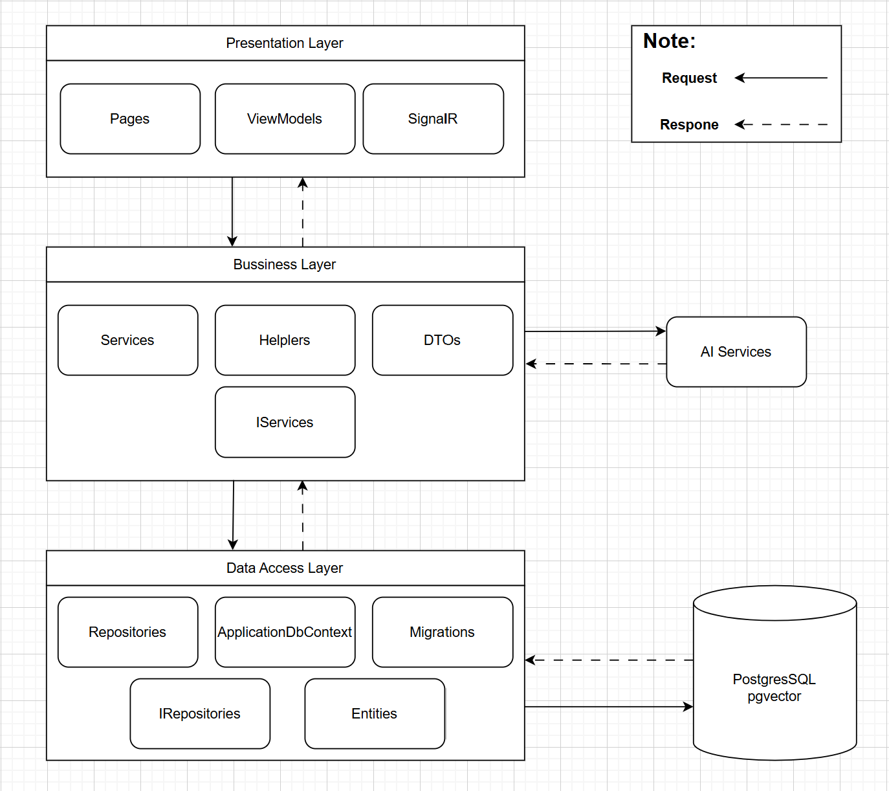

# 🤖 ChatEdu AI - Hệ Thống Trợ Lý Học Tập Thông Minh

ChatEdu AI là một nền tảng hỗ trợ học tập tích hợp Trợ lý Trí tuệ Nhân tạo (Generative AI), giúp sinh viên tra cứu, ôn tập và hỏi đáp kiến thức dựa trên nguồn tài liệu chuẩn do Giảng viên cung cấp.

---

## 🛠 Công Nghệ Sử Dụng

- **Backend:** C# / .NET 8, ASP.NET Core Razor Pages
- **Database:** PostgreSQL (Entity Framework Core)
- **AI Engine:** Google Gemini API (`gemini-flash-latest` & `gemini-embedding-001`)
- **Real-time Sync:** ASP.NET Core SignalR (Đồng bộ dữ liệu thời gian thực không cần tải lại trang)
- **Tương tác Frontend:** HTML, CSS (Custom Design), JavaScript, Bootstrap
- **Xử lý tài liệu:** Trích xuất nội dung từ định dạng `.pdf`, `.docx`, `.pptx` (Sử dụng PdfPig và OpenXML).

---

## 🏛 Kiến Trúc Hệ Thống

Dự án được xây dựng theo mô hình **3-Tier Architecture** (3 lớp) kết hợp với các dịch vụ AI và Cơ sở dữ liệu:



---

## ⚙️ Hướng Dẫn Cài Đặt (Dành cho Developer)

### 1. Yêu cầu hệ thống
- Tải và cài đặt [.NET 8 SDK](https://dotnet.microsoft.com/download/dotnet/8.0).
- Tải và cài đặt [PostgreSQL](https://www.postgresql.org/download/).

### 2. Thiết lập Môi Trường (.env)
Tạo một file có tên `.env` ở ngay thư mục gốc của dự án (cùng cấp với thư mục `PresentationLayer`) với cấu trúc sau:

```env
# Cấu hình CSDL PostgreSQL
DB_CONNECTION_STRING=Host=localhost;Database=ChatEduDb;Username=postgres;Password=mat_khau_cua_ban

# Cấu hình Gemini AI API (Phải bắt đầu bằng AIza... hoặc AQ...)
GEMINI_API_KEY=Khóa_API_Của_Bạn_Từ_Google_AI_Studio

# Cấu hình SMTP Gmail (Dành cho chức năng quên mật khẩu / thông báo)
SMTP_HOST=smtp.gmail.com
SMTP_PORT=587
SMTP_USER=email_cua_ban@gmail.com
SMTP_PASS=app_password_16_ky_tu
SMTP_FROM_NAME=EduManager

# Cấu hình Thanh toán VNPay
VNPay__TmnCode=your-vnpay-tmn-code
VNPay__HashSecret=your-vnpay-hash-secret
VNPay__BaseUrl=vpcpay.html
VNPay__ReturnUrl=Payment/Callback

# Cấu hình Thanh toán PayOS
PayOS__ClientId=your-payos-client-id
PayOS__ApiKey=your-payos-api-key
PayOS__ChecksumKey=your-payos-checksum-key

# Cấu hình Thanh toán SePay
SePay__ApiKey=your-sepay-api-key
```

### 3. Cập nhật Database
Mở Terminal / Command Prompt tại thư mục dự án và chạy:
```bash
dotnet ef database update --project DataAccessLayer --startup-project PresentationLayer
```

### 4. Chạy Dự Án
```bash
cd PresentationLayer
dotnet run
```
Sau đó truy cập vào đường dẫn: `http://localhost:5000` (hoặc cổng được cấu hình).

---

## 📖 Hướng Dẫn Sử Dụng (Dành cho Người Dùng Cuối)

Hệ thống được chia làm hai vai trò chính: **Giảng Viên** và **Sinh Viên**.

### 👩‍🏫 Dành Cho Giảng Viên (Quản lý nội dung)
1. **Đăng nhập:** Đăng nhập bằng tài khoản Giảng viên.
2. **Quản lý Môn học (Real-time Sync):** 
   - Truy cập trang "Môn học của tôi" hoặc "Tất cả môn học".
   - **Lưu ý:** Việc tạo mới và xóa môn học do **Admin** đảm nhiệm. Giảng viên chỉ có quyền **sửa** (đổi tên/mã) các môn học mà mình được phân công phụ trách.
   - ⚡ *Tính năng SignalR*: Mọi thay đổi về môn học (Thêm/Sửa/Xóa từ Admin/Giảng viên) sẽ ngay lập tức được đồng bộ theo thời gian thực (real-time) tới tất cả Giảng viên, Sinh viên và Admin đang online mà không cần tải lại trang.
   - Thêm các "Chương" (Chapters) vào từng môn học để phân chia kiến thức rõ ràng.
3. **Quản lý Tài liệu:**
   - Truy cập trang "Tài liệu".
   - Tải lên tài liệu (hỗ trợ file `.pdf`, `.docx`, `.pptx`).
   - Gán tài liệu vào Môn học và Chương tương ứng.
   - Hệ thống sẽ tự động quét, trích xuất văn bản (extract text), và tạo AI Embedding ngầm.
   - Sau khi trạng thái báo `Indexed`, sinh viên có thể bắt đầu sử dụng tài liệu này để hỏi AI.

### 👨‍🎓 Dành Cho Sinh Viên (Học tập & Hỏi đáp)
1. **Trang Chủ (Chat AI):**
   - Truy cập menu **"Chatbot"** hoặc trang chủ.
   - Cột bên trái hiển thị toàn bộ tài liệu giảng viên đã tải lên, được phân loại theo từng thư mục môn học vô cùng trực quan.
2. **Tùy biến Phạm vi Trả lời:**
   - **Tất cả (Global Knowledge):** Trợ lý AI sẽ trả lời tự do bằng kiến thức cá nhân của nó nếu tài liệu không có.
   - **Trong phạm vi tài liệu:** AI sẽ bị ép buộc chỉ trả lời dựa trên những gì giảng viên đã tải lên. Nếu câu hỏi không nằm trong tài liệu, AI sẽ từ chối trả lời.
3. **Quản lý Cuộc trò chuyện:**
   - Click nút **"+ MỚI"** để tạo một phiên chat mới.
   - Chọn vào các phiên cũ để xem lại lịch sử trò chuyện. Lịch sử được lưu trữ ngay trên trình duyệt (Local Storage) để bảo mật cá nhân.
4. **Đọc Tài liệu:**
   - Tại cột bên trái, bấm vào biểu tượng con mắt 👁 bên cạnh mỗi tài liệu để xem nội dung văn bản thuần mà AI đang "đọc hiểu".

### 💳 Hướng dẫn Thanh toán / Nâng cấp gói cước (Dành cho môi trường Test)
Để nâng cấp gói cước trên môi trường thử nghiệm (Sandbox) qua cổng thanh toán, vui lòng sử dụng thông tin thẻ test sau khi chuyển hướng đến trang thanh toán:
- **Ngân hàng:** NCB
- **Số thẻ:** `9704198526191432198`
- **Tên chủ thẻ:** `NGUYEN VAN A`
- **Ngày phát hành:** `07/15`
- **Mật khẩu OTP:** `123456`

---

## 🐞 Gỡ Lỗi Thường Gặp (Troubleshooting)

- **Lỗi 404 khi gọi AI:** Do API Key không tương thích với model. Hãy đảm bảo API Key của bạn là mới nhất và hỗ trợ `gemini-flash-latest`.
- **Sự cố dính Font (Mojibake):** Hệ thống đã tích hợp tự động sửa lỗi tiếng Việt Unicode trên giao diện, vui lòng không cài thêm các tiện ích can thiệp Font trên trình duyệt.
- **Tốc độ phản hồi chậm:** Do database lưu trữ quá nhiều vector embeddings. Hệ thống đã tối ưu bằng `.AsNoTracking()` và `.AsSplitQuery()` nên bạn chỉ cần đảm bảo PostgreSQL đang phân bổ đủ RAM.
- **Không tự động chọn tài liệu:** Là tính năng mặc định để tránh việc AI phải đọc số lượng dữ liệu rác không mong muốn. Người dùng được khuyến nghị tự tick ✅ vào các file PDF muốn kiểm tra.

---
*Phát triển bởi TriTin3011 - 2026*