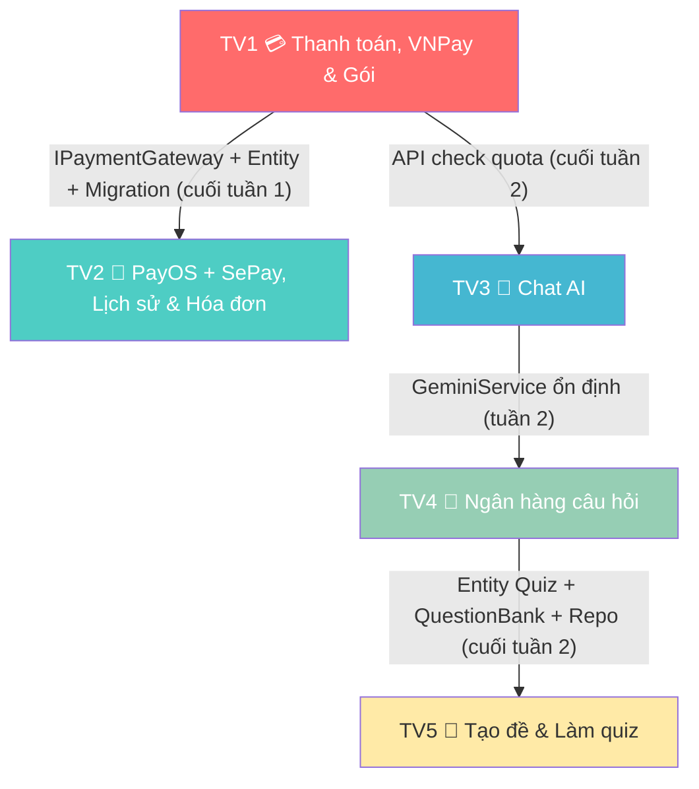

# 📋 PHÂN CÔNG CÔNG VIỆC NHÓM - ChatEdu AI

> **Môn:** PRN  
> **Deadline:** Tuần 9 sau nghỉ hè — Demo full luồng  
> **Ngày tạo:** 08/07/2026  
> **Số thành viên:** 5 người  
> **Phương pháp:** Vertical Slice — mỗi thành viên làm **từ đầu đến cuối** (Entity → Repository → Service → DTO → Page) cho tính năng của mình

---

## 📌 Tổng quan phân chia

| TV | Tính năng (Slice) | Tổng task | Độ khó |
|----|-------------------|-----------|--------|
| TV1 | 💳 Thanh toán mua gói, VNPay & Quản lý Subscription | 13 | ⭐⭐⭐⭐ |
| TV2 | 📜 PayOS + SePay, Lịch sử thanh toán & Hóa đơn Email | 13 | ⭐⭐⭐⭐ |
| TV3 | 🤖 Hoàn chỉnh luồng Chat AI | 10 | ⭐⭐⭐⭐ |
| TV4 | 📝 Ngân hàng câu hỏi & AI tạo câu hỏi | 11 | ⭐⭐⭐⭐ |
| TV5 | 🎯 Tạo đề thi, Làm quiz & Xem điểm | 12 | ⭐⭐⭐⭐ |

---

## 👤 TV1 — 💳 Thanh toán mua gói, VNPay & Quản lý Subscription

> **Slice:** User chọn gói (Basic/Pro/Ultra) → Chọn phương thức TT → Thanh toán VNPay → Kích hoạt gói → Limit theo tháng → Auto reset quota  
> **TV1 xây dựng toàn bộ hạ tầng thanh toán** (`IPaymentGateway` interface) + implement VNPay. TV2 sẽ cài thêm PayOS & SePay dựa trên interface này.  
> **Làm từ đầu đến cuối, theo thứ tự:**

| # | Task | Thứ tự | Trạng thái |
|---|------|--------|------------|
| 1 | **Entity** `SubscriptionPlan` — cập nhật thêm trường features (JSON), durationDays. Định nghĩa 3 gói: Basic (giá X, limit Y câu/tháng), Pro (giá X, limit Y), Ultra (giá X, unlimited) | Entity | ⬜ |
| 2 | **Entity** `PaymentTransaction` — (id, userId, planId, amount, **paymentMethod** [VNPay/PayOS/SePay], status [Pending/Success/Failed], transactionCode, createdAt, expiryDate). Thêm navigation property trong `User` | Entity | ⬜ |
| 3 | **Migration** — chạy migration cho entity mới/cập nhật, seed data 3 gói vào DB | Migration | ⬜ |
| 4 | **Repository** `IPaymentTransactionRepository` + `PaymentTransactionRepository` — CRUD giao dịch, lấy theo userId, lấy theo status | Repository | ⬜ |
| 5 | **Interface** tạo `IPaymentGateway` — interface chung cho tất cả cổng thanh toán: `CreatePaymentUrl(PaymentRequest)`, `ValidateCallback(Dictionary params)`, `GetGatewayName()`. Tạo `PaymentRequest` DTO chung (amount, orderId, description, returnUrl) | Interface | ⬜ |
| 6 | **Service** tạo `PaymentGatewayFactory` — factory pattern chọn gateway theo `paymentMethod` string → trả về `IPaymentGateway` tương ứng. Đăng ký DI cho tất cả gateway | Service | ⬜ |
| 7 | **Service** implement `VNPayGateway : IPaymentGateway` — refactor `VNPayService` hiện tại thành implement interface mới: tạo payment URL, validate callback signature, cập nhật `PaymentTransaction` | Service | ⬜ |
| 8 | **Service** cập nhật `SubscriptionService` — logic nâng/hạ gói, kiểm tra hết hạn, kiểm tra limit, tăng `MonthlyQuestionCount` khi user hỏi | Service | ⬜ |
| 9 | **Service** tạo `QuotaResetBackgroundService` — Background Service chạy định kỳ, check `QuotaResetDate`, reset `MonthlyQuestionCount = 0` cho user đến hạn | Service | ⬜ |
| 10 | **Page** cập nhật `Subscription/Index.cshtml` — hiển thị 3 gói dạng pricing card (tên gói, giá, features, limit), nút "Mua ngay" / "Nâng cấp", highlight gói hiện tại của user | Page | ⬜ |
| 11 | **Page** cập nhật `Payment/Create.cshtml` — trang xác nhận đơn hàng + **chọn phương thức thanh toán** (radio button: VNPay / PayOS / SePay với logo) → gọi `PaymentGatewayFactory` → redirect đến gateway tương ứng | Page | ⬜ |
| 12 | **Page** cập nhật `Payment/Callback.cshtml` — nhận kết quả callback từ **bất kỳ gateway nào** (detect theo route/param), validate → hiển thị thành công/thất bại, cập nhật gói user | Page | ⬜ |
| 13 | **Page** cập nhật `Admin/Plans.cshtml` — Admin quản lý CRUD gói subscription | Page | ⬜ |

### Kiến trúc Payment Gateway (Strategy Pattern)

```
IPaymentGateway (interface)
├── VNPayGateway        ← TV1 implement
├── PayOSGateway        ← TV2 implement
└── SePayGateway        ← TV2 implement

PaymentGatewayFactory   ← TV1 tạo, TV2 đăng ký thêm gateway
```

### Files đã có (cần sửa):
- `DataAccessLayer/Entities/SubscriptionPlan.cs`, `User.cs`
- `BussinessLayer/Services/SubscriptionService.cs`, `VNPayService.cs` (refactor), `SubscriptionPlanService.cs`
- `PresentationLayer/Pages/Subscription/Index.cshtml`, `Payment/Create.cshtml`, `Payment/Callback.cshtml`

### Files cần tạo mới:
- `DataAccessLayer/Entities/PaymentTransaction.cs`
- `DataAccessLayer/IRepositories/IPaymentTransactionRepository.cs`
- `DataAccessLayer/Repositories/PaymentTransactionRepository.cs`
- `BussinessLayer/Services/IPaymentGateway.cs` (interface)
- `BussinessLayer/Services/PaymentGatewayFactory.cs`
- `BussinessLayer/Services/VNPayGateway.cs` (refactor từ VNPayService)
- `BussinessLayer/DTOs/PaymentRequest.cs`
- `BussinessLayer/Services/QuotaResetBackgroundService.cs`

---

## 👤 TV2 — 📜 PayOS + SePay, Lịch sử thanh toán & Hóa đơn Email

> **Slice:** Implement PayOS & SePay gateway → Lịch sử thanh toán (User/Admin) → Gửi hóa đơn email tự động  
> TV2 implement 2 cổng thanh toán mới dựa trên `IPaymentGateway` interface mà TV1 đã tạo.  
> **Làm từ đầu đến cuối, theo thứ tự:**

| # | Task | Thứ tự | Trạng thái |
|---|------|--------|------------|
| 1 | **Service** implement `PayOSGateway : IPaymentGateway` — tích hợp PayOS SDK: tạo payment link, xử lý webhook/callback, validate signature, cập nhật `PaymentTransaction` | Gateway | ⬜ |
| 2 | **Service** implement `SePayGateway : IPaymentGateway` — tích hợp SePay API: tạo QR / payment URL, xử lý webhook callback xác nhận chuyển khoản, cập nhật `PaymentTransaction` | Gateway | ⬜ |
| 3 | **Service** đăng ký PayOS + SePay vào `PaymentGatewayFactory` (DI container) + cấu hình API key/secret trong `appsettings.json` | Gateway | ⬜ |
| 4 | **DTO** tạo `PaymentHistoryDto` (transactionId, userName, planName, amount, method, status, date), `InvoiceDto` (thông tin hóa đơn chi tiết) | DTO | ⬜ |
| 5 | **Repository** — thêm method vào `IPaymentTransactionRepository` (hoặc tạo riêng): `GetByUserId()`, `GetAll()` với filter/paging/search | Repository | ⬜ |
| 6 | **Service** tạo `IPaymentHistoryService` + implementation — lấy lịch sử theo userId (cho User), lấy toàn bộ có filter (cho Admin), phân trang, tìm kiếm theo tên user/ngày/gói/phương thức | Service | ⬜ |
| 7 | **Service** tạo HTML template hóa đơn — email template đẹp: logo, thông tin giao dịch, tên gói, giá, ngày TT, ngày hết hạn, mã giao dịch, **phương thức thanh toán** | Service | ⬜ |
| 8 | **Service** cập nhật `EmailService` — thêm `SendInvoiceEmailAsync(PaymentTransaction transaction)`, render template + gửi email cho user | Service | ⬜ |
| 9 | **Service** tích hợp auto gửi email — gọi `SendInvoiceEmailAsync()` trong callback thanh toán thành công (phối hợp TV1 gọi trong `Payment/Callback`) | Service | ⬜ |
| 10 | **Page** tạo `PaymentHistory/Index.cshtml` — User xem lịch sử thanh toán của mình: bảng danh sách (ngày, gói, số tiền, **phương thức**, trạng thái), filter theo ngày/phương thức/trạng thái, phân trang | Page | ⬜ |
| 11 | **Page** tạo `Admin/PaymentHistory.cshtml` — Admin xem toàn bộ lịch sử: bảng danh sách có cột tên user + phương thức TT, ô tìm kiếm, filter theo user/ngày/gói/gateway/trạng thái, phân trang | Page | ⬜ |
| 12 | **Page** thêm popup/modal "Chi tiết hóa đơn" — hiển thị đầy đủ thông tin giao dịch + nút "Gửi lại email" | Page | ⬜ |
| 13 | **Page** cập nhật Navigation — thêm link "Lịch sử thanh toán" vào menu User và sidebar Admin | Page | ⬜ |

### Kiến trúc: TV2 implement 2 gateway dựa trên interface TV1

```
IPaymentGateway (TV1 tạo interface)
├── VNPayGateway        ← TV1 đã implement
├── PayOSGateway        ← ✅ TV2 implement
└── SePayGateway        ← ✅ TV2 implement
```

### Files đã có (cần sửa):
- `BussinessLayer/Services/EmailService.cs`, `IEmailService.cs`
- `BussinessLayer/Services/PaymentGatewayFactory.cs` (TV1 tạo, TV2 đăng ký thêm)
- `PresentationLayer/Pages/Admin/Dashboard.cshtml` (thêm link sidebar)
- Shared layout (thêm menu "Lịch sử TT")
- `appsettings.json` (thêm PayOS + SePay config)

### Files cần tạo mới:
- `BussinessLayer/Services/PayOSGateway.cs`
- `BussinessLayer/Services/SePayGateway.cs`
- `BussinessLayer/DTOs/PaymentHistoryDto.cs`, `InvoiceDto.cs`
- `BussinessLayer/Services/PaymentHistoryService.cs`, `IPaymentHistoryService.cs`
- `PresentationLayer/Pages/PaymentHistory/Index.cshtml` + `.cs`
- `PresentationLayer/Pages/Admin/PaymentHistory.cshtml` + `.cs`

### ⚠️ Dependency: Chờ TV1 xong `IPaymentGateway` interface + `PaymentTransaction` Entity + Migration (cuối tuần 1) mới bắt đầu implement gateway

---

## 👤 TV3 — 🤖 Hoàn chỉnh luồng Chat AI

> **Slice:** User mở chat → check quota → hỏi AI dựa trên tài liệu → nhận response streaming → xem lịch sử chat → thông báo hết quota  
> **Làm từ đầu đến cuối, theo thứ tự:**

| # | Task | Thứ tự | Trạng thái |
|---|------|--------|------------|
| 1 | **Entity** review `ChatSession`, `ChatMessage` — thêm trường nếu cần (subjectId để biết chat về môn nào, messageType cho system messages) | Entity | ⬜ |
| 2 | **Service** review & fix `ChatService` — đảm bảo luồng hỏi-đáp ổn định, xử lý context từ `DocumentChunk`, lưu tin nhắn đúng | Service | ⬜ |
| 3 | **Service** cập nhật `GeminiService` — tối ưu prompt engineering (system prompt + document context + user question), cải thiện chất lượng trả lời | Service | ⬜ |
| 4 | **Service** tích hợp quota check — trước khi chat: kiểm tra `MonthlyQuestionCount` vs limit gói hiện tại, trả lỗi nếu hết quota (phối hợp TV1) | Service | ⬜ |
| 5 | **Service** xử lý streaming response — sử dụng Gemini streaming API + SignalR để gửi từng phần response về client real-time | Service | ⬜ |
| 6 | **Service** xử lý edge cases — timeout API, message quá dài (cắt/báo lỗi), rate limiting, file không hỗ trợ, retry logic | Service | ⬜ |
| 7 | **Service** tối ưu hiệu năng — cache document chunks đã load, lazy loading tin nhắn cũ (phân trang messages) | Service | ⬜ |
| 8 | **Page** cập nhật `Chat/Index.cshtml` — hiển thị badge gói hiện tại + số câu hỏi còn lại (VD: "Pro — 45/100 câu"), thông báo khi gần hết/hết quota | Page | ⬜ |
| 9 | **Page** cải thiện UI chat — sidebar danh sách session cũ (click để tiếp tục), nút tạo session mới, nút xóa session, typing indicator khi AI đang trả lời, render markdown trong response | Page | ⬜ |
| 10 | **Page** responsive + UX — chat hoạt động tốt trên mobile, nút gợi ý nâng cấp gói khi hết quota (link đến trang Subscription) | Page | ⬜ |

### Files đã có (cần sửa):
- `DataAccessLayer/Entities/ChatSession.cs`, `ChatMessage.cs`
- `BussinessLayer/Services/ChatService.cs`, `GeminiService.cs`
- `PresentationLayer/Pages/Chat/Index.cshtml` + `.cs`
- `PresentationLayer/SignalR/` (ChatHub)

### ⚠️ Dependency: Cần TV1 cung cấp API check quota/limit (cuối tuần 2)

---

## 👤 TV4 — 📝 Ngân hàng câu hỏi & AI tạo câu hỏi

> **Slice:** Lecturer chọn môn → yêu cầu AI tạo câu hỏi (chủ đề, số câu, độ khó) → review/edit câu hỏi → lưu vào ngân hàng → quản lý CRUD ngân hàng câu hỏi  
> **Làm từ đầu đến cuối, theo thứ tự:**

| # | Task | Thứ tự | Trạng thái |
|---|------|--------|------------|
| 1 | **Entity** tạo `QuestionBank` — (id, subjectId, content, questionType [MultipleChoice/TrueFalse], optionsJson, correctAnswer, difficulty [Easy/Medium/Hard], tags, isAIGenerated, lecturerId, createdAt) | Entity | ⬜ |
| 2 | **Entity** tạo `Quiz` — (id, title, description, subjectId, lecturerId, totalQuestions, isShuffled, numVariants, showScoreAfterSubmit, timeLimitMinutes, status [Draft/Open/Closed], startTime, endTime, createdAt) | Entity | ⬜ |
| 3 | **Entity** tạo `QuizQuestion` — (id, quizId, questionBankId, variantIndex, orderIndex) — bảng trung gian liên kết quiz với câu hỏi, hỗ trợ nhiều đề | Entity | ⬜ |
| 4 | **Migration** — chạy migration cho 3 entity mới, cập nhật `ApplicationDbContext` với DbSet + relationship config | Migration | ⬜ |
| 5 | **Repository** tạo `IQuestionBankRepository` + implementation — CRUD, lấy theo subjectId, filter theo difficulty/tag/type, đếm số câu theo môn, phân trang | Repository | ⬜ |
| 6 | **Repository** tạo `IQuizRepository` + implementation — CRUD quiz, lấy theo subjectId/lecturerId, lấy quiz kèm danh sách câu hỏi | Repository | ⬜ |
| 7 | **DTO** tạo `QuestionBankDto`, `CreateQuestionDto`, `AIGenerateRequestDto`, `AIGenerateResultDto` | DTO | ⬜ |
| 8 | **Service** tạo `IQuestionBankService` + implementation — CRUD câu hỏi, filter/search, validate dữ liệu, thống kê số câu theo môn/độ khó | Service | ⬜ |
| 9 | **Service** tạo `IAIQuizGeneratorService` + implementation — gọi `GeminiService` với prompt tạo câu hỏi (đầu vào: môn, chủ đề, số câu, độ khó) → parse JSON response → trả về danh sách câu hỏi để Lecturer review | Service | ⬜ |
| 10 | **Page** tạo `Lecturer/QuestionBank.cshtml` — bảng danh sách câu hỏi (filter theo môn/độ khó), nút thêm/sửa/xóa, modal form thêm câu hỏi thủ công (nhập nội dung, options, đáp án đúng), phân trang | Page | ⬜ |
| 11 | **Page** tạo `Lecturer/AIGenerateQuestions.cshtml` — form yêu cầu: chọn môn, nhập chủ đề, chọn số câu, chọn độ khó → nút "AI Tạo câu hỏi" → hiển thị danh sách preview → Lecturer tick chọn/edit từng câu → nút "Lưu vào ngân hàng" | Page | ⬜ |

### Files đã có (cần sửa):
- `DataAccessLayer/ApplicationDbContext.cs` (thêm DbSet)
- `BussinessLayer/Services/GeminiService.cs` (TV4 sử dụng, phối hợp TV3)

### Files cần tạo mới:
- `DataAccessLayer/Entities/QuestionBank.cs`, `Quiz.cs`, `QuizQuestion.cs`
- `DataAccessLayer/IRepositories/IQuestionBankRepository.cs` + implementation
- `DataAccessLayer/IRepositories/IQuizRepository.cs` + implementation
- `BussinessLayer/DTOs/QuestionBankDto.cs`, `AIGenerateRequestDto.cs`
- `BussinessLayer/Services/QuestionBankService.cs`, `IQuestionBankService.cs`
- `BussinessLayer/Services/AIQuizGeneratorService.cs`, `IAIQuizGeneratorService.cs`
- `PresentationLayer/Pages/Lecturer/QuestionBank.cshtml` + `.cs`
- `PresentationLayer/Pages/Lecturer/AIGenerateQuestions.cshtml` + `.cs`

### ⚠️ Dependency: TV3 đảm bảo `GeminiService` hoạt động ổn (tuần 2) để TV4 gọi tạo câu hỏi

---

## 👤 TV5 — 🎯 Tạo đề thi, Làm Quiz & Xem điểm

> **Slice:** Lecturer chọn câu từ ngân hàng → cấu hình quiz (xáo trộn, chia đề, time limit) → mở quiz → Student vào làm → nộp bài → tính điểm → Lecturer xem bảng điểm  
> **Làm từ đầu đến cuối, theo thứ tự:**

| # | Task | Thứ tự | Trạng thái |
|---|------|--------|------------|
| 1 | **Entity** tạo `QuizAttempt` — (id, quizId, studentId, variantIndex, startTime, endTime, score, totalQuestions, correctCount, status [InProgress/Submitted/Graded]) | Entity | ⬜ |
| 2 | **Entity** tạo `QuizAnswer` — (id, attemptId, questionBankId, selectedAnswer, isCorrect) | Entity | ⬜ |
| 3 | **Migration** — migration cho 2 entity mới, cập nhật `ApplicationDbContext` | Migration | ⬜ |
| 4 | **Repository** tạo `IQuizAttemptRepository` + implementation — CRUD attempt, lấy theo quizId/studentId, lấy kèm answers, thống kê điểm | Repository | ⬜ |
| 5 | **DTO** tạo `CreateQuizDto`, `QuizDetailDto`, `TakeQuizDto`, `SubmitQuizDto`, `QuizResultDto`, `QuizStatisticsDto` | DTO | ⬜ |
| 6 | **Service** tạo `IQuizService` + implementation — Lecturer tạo quiz: chọn câu hỏi từ ngân hàng → logic xáo trộn câu hỏi → logic chia đề (tạo N variants, mỗi variant shuffle thứ tự câu khác nhau) → lưu `QuizQuestion` | Service | ⬜ |
| 7 | **Service** tạo `IQuizAttemptService` + implementation — SV bắt đầu quiz (gán variant ngẫu nhiên, ghi startTime) → SV nộp bài (ghi endTime, so sánh đáp án, tính điểm, lưu `QuizAnswer`) → kiểm tra đã làm chưa/hết giờ chưa | Service | ⬜ |
| 8 | **Page** tạo `Lecturer/CreateQuiz.cshtml` — form tạo quiz: chọn môn → load câu hỏi từ ngân hàng (checkbox chọn) → nhập tên quiz, time limit → toggle xáo trộn, toggle hiện điểm → nhập số đề chia → nút "Tạo quiz" | Page | ⬜ |
| 9 | **Page** tạo `Lecturer/QuizResults.cshtml` — bảng điểm: danh sách SV đã làm (tên, điểm, thời gian làm), thống kê (điểm TB, cao nhất, thấp nhất, phân bố điểm), nút export | Page | ⬜ |
| 10 | **Page** tạo `Student/QuizList.cshtml` — danh sách quiz đang mở cho SV (theo môn đang học): tên quiz, môn, thời gian, trạng thái (Chưa làm / Đã làm / Hết hạn), nút "Vào làm" | Page | ⬜ |
| 11 | **Page** tạo `Student/TakeQuiz.cshtml` — **giao diện làm quiz giống LMS**: đếm giờ countdown, hiển thị câu hỏi + options (radio button), navigation panel (nhảy đến câu bất kỳ, đánh dấu câu đã làm/chưa làm), nút nộp bài + confirm popup | Page | ⬜ |
| 12 | **Page** tạo `Student/QuizResult.cshtml` — hiển thị điểm (nếu Lecturer cho phép `showScoreAfterSubmit`), xem lại từng câu: đề bài, đáp án đã chọn, đáp án đúng (nếu cho xem), đúng ✅ / sai ❌ | Page | ⬜ |

### Files đã có (cần sửa):
- `DataAccessLayer/ApplicationDbContext.cs` (thêm DbSet)
- Navigation/Menu (thêm link Quiz cho Student + Lecturer)

### Files cần tạo mới:
- `DataAccessLayer/Entities/QuizAttempt.cs`, `QuizAnswer.cs`
- `DataAccessLayer/IRepositories/IQuizAttemptRepository.cs` + implementation
- `BussinessLayer/DTOs/CreateQuizDto.cs`, `QuizResultDto.cs`, `SubmitQuizDto.cs`, ...
- `BussinessLayer/Services/QuizService.cs`, `IQuizService.cs`
- `BussinessLayer/Services/QuizAttemptService.cs`, `IQuizAttemptService.cs`
- `PresentationLayer/Pages/Lecturer/CreateQuiz.cshtml` + `.cs`
- `PresentationLayer/Pages/Lecturer/QuizResults.cshtml` + `.cs`
- `PresentationLayer/Pages/Student/QuizList.cshtml` + `.cs`
- `PresentationLayer/Pages/Student/TakeQuiz.cshtml` + `.cs`
- `PresentationLayer/Pages/Student/QuizResult.cshtml` + `.cs`

### ⚠️ Dependency: Chờ TV4 xong Entity `Quiz`, `QuestionBank`, `QuizQuestion` + Repository (cuối tuần 2)

---

## 🔗 Dependency & Timeline

### Sơ đồ phụ thuộc



### Timeline chi tiết

```
TUẦN 1 ──────────────────────────────────────────────
  TV1: Entity + Migration + Repository + IPaymentGateway interface + PaymentGatewayFactory
  TV2: Chuẩn bị DTO, nghiên cứu PayOS SDK + SePay API (chờ TV1 xong interface)
  TV3: Review & fix ChatService + GeminiService
  TV4: Entity QuestionBank + Quiz + QuizQuestion + Migration
  TV5: Entity QuizAttempt + QuizAnswer + Migration
  
  ✅ Milestone: Tất cả Entity + Migration hoàn thành, IPaymentGateway interface sẵn sàng

TUẦN 2 ──────────────────────────────────────────────
  TV1: VNPayGateway + SubscriptionService + QuotaResetService
  TV2: PayOSGateway + SePayGateway + đăng ký vào Factory
  TV3: Quota check + Streaming + Edge cases
  TV4: Repository + QuestionBankService + AIQuizGeneratorService
  TV5: Repository + DTO (chờ TV4 xong entity Quiz)
  
  ✅ Milestone: Tất cả Gateway + Service hoàn thành

TUẦN 3-4 ────────────────────────────────────────────
  TV1: Page Subscription + Payment (Create với chọn gateway, Callback)
  TV2: PaymentHistoryService + EmailService + Page PaymentHistory (User + Admin)
  TV3: Page Chat/Index (UI, sidebar session, quota badge)
  TV4: Page QuestionBank + AIGenerateQuestions
  TV5: QuizService + QuizAttemptService + Page CreateQuiz
  
  ✅ Milestone: Frontend cơ bản hoàn thành

TUẦN 5-6 ────────────────────────────────────────────
  TV1: Test luồng thanh toán VNPay end-to-end
  TV2: Test PayOS + SePay end-to-end, test email hóa đơn
  TV3: Polish UI chat, responsive, test streaming
  TV4: Test AI generate, fix prompt, polish UI
  TV5: Page QuizList + TakeQuiz + QuizResult (Student)
  
  ✅ Milestone: Tất cả tính năng hoạt động

TUẦN 7 ──────────────────────────────────────────────
  CẢ NHÓM: Tích hợp test full flow, fix bug, code review

TUẦN 8 ──────────────────────────────────────────────
  CẢ NHÓM: Buffer — polish UI, fix bug cuối, chuẩn bị demo

TUẦN 9 ──────────────────────────────────────────────
  🎯 DEMO
```

---

## 📊 Bảng tổng hợp khối lượng

| TV | Entity | Repo | Interface | Gateway | Service | DTO | Page | Tổng | Ghi chú |
|----|--------|------|-----------|---------|---------|-----|------|------|---------|
| TV1 | 2 | 1 | 1 | 1 (VNPay) | 3 | 1 | 4 | **13** | Xây hạ tầng thanh toán + VNPay |
| TV2 | — | 1 | — | 2 (PayOS+SePay) | 4 | 2 | 4 | **13** | 2 gateway mới + lịch sử + hóa đơn |
| TV3 | 1 | — | — | — | 5 | — | 3 | **10** | Có sẵn code, chủ yếu fix & improve |
| TV4 | 3 | 2 | — | — | 2 | 1 | 2 | **11** | Tạo mới nhiều, phối hợp TV3 |
| TV5 | 2 | 1 | — | — | 2 | 1 | 5 | **12** | Nhiều page nhất (cả Lecturer + Student) |

---

## ✅ Checklist Demo Tuần 9

### 💳 Thanh toán (TV1 + TV2)
- [ ] Hiển thị 3 gói Basic / Pro / Ultra
- [ ] Chọn phương thức thanh toán (VNPay / PayOS / SePay)
- [ ] Thanh toán VNPay thành công → kích hoạt gói (TV1)
- [ ] Thanh toán PayOS thành công → kích hoạt gói (TV2)
- [ ] Thanh toán SePay thành công → kích hoạt gói (TV2)
- [ ] Quota limit hoạt động, auto reset hàng tháng

### 📜 Lịch sử & Hóa đơn (TV2)
- [ ] User xem lịch sử thanh toán của mình (hiện phương thức TT)
- [ ] Admin xem toàn bộ lịch sử (filter theo gateway)
- [ ] Email hóa đơn gửi tự động sau thanh toán

### 🤖 Chat AI (TV3)
- [ ] Chat AI hoạt động ổn định
- [ ] Kiểm tra quota, hiển thị số câu còn lại
- [ ] Streaming response, lịch sử session

### 📝 Ngân hàng câu hỏi (TV4)
- [ ] AI tạo câu hỏi → Lecturer review → lưu ngân hàng
- [ ] CRUD câu hỏi thủ công
- [ ] Filter theo môn/độ khó

### 🎯 Quiz (TV5)
- [ ] Lecturer tạo quiz (chọn câu, xáo trộn, chia đề)
- [ ] Student làm quiz (UI giống LMS, countdown)
- [ ] Xem điểm + Lecturer xem bảng điểm

### 🔄 Full Flow
- [ ] Đăng ký → Mua gói (chọn VNPay/PayOS/SePay) → Chat AI → Tạo quiz → Làm quiz → Xem điểm

---

## 📝 Quy ước làm việc

### Git Branch
```
main
├── feature/payment-subscription     (TV1)
├── feature/payment-history-invoice  (TV2)
├── feature/chat-ai                  (TV3)
├── feature/quiz-question-bank       (TV4)
└── feature/quiz-take-exam           (TV5)
```

### Quy tắc chung
1. **Mỗi TV làm từ đầu đến cuối** — Entity → Migration → Repository → DTO → Service → Page
2. **Không push trực tiếp `main`** — tạo Pull Request để review
3. Khi xong **Entity + Migration**: báo cho TV phụ thuộc biết để bắt đầu
4. **Daily update** tiến độ (15 phút) qua nhóm chat
5. **Mỗi tuần** merge branch về `develop` và test tích hợp
6. Gặp **blocker** → báo ngay
7. TV nào **xong sớm** → hỗ trợ TV khác

---

> ⚠️ **QUAN TRỌNG:** Thay **TV1–TV5** bằng tên thật các thành viên trong nhóm!
